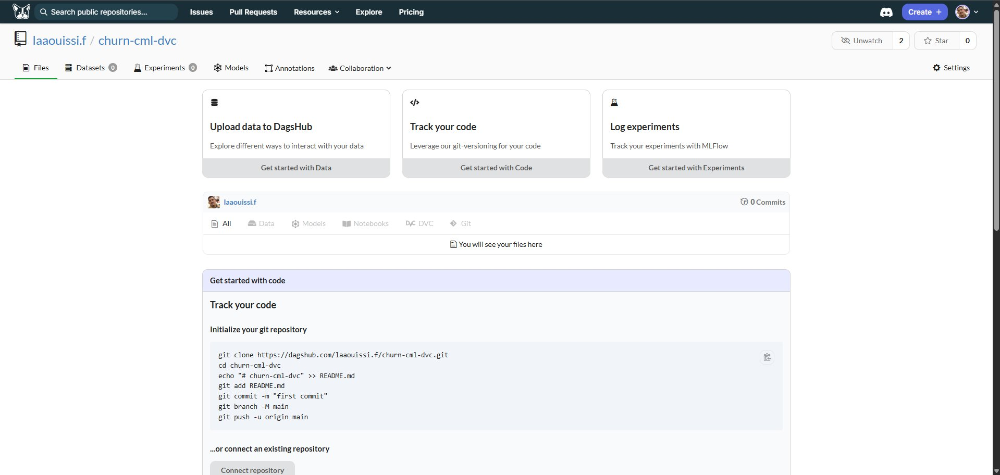
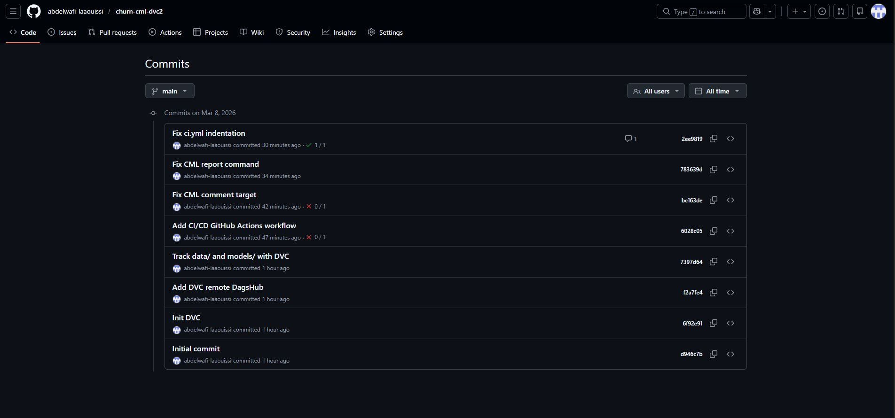
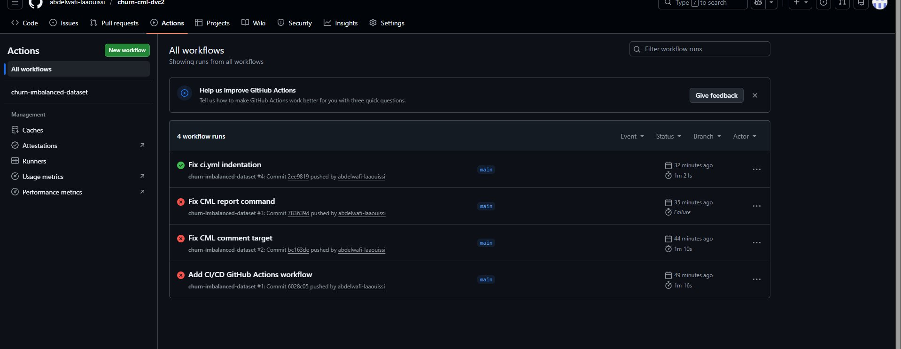
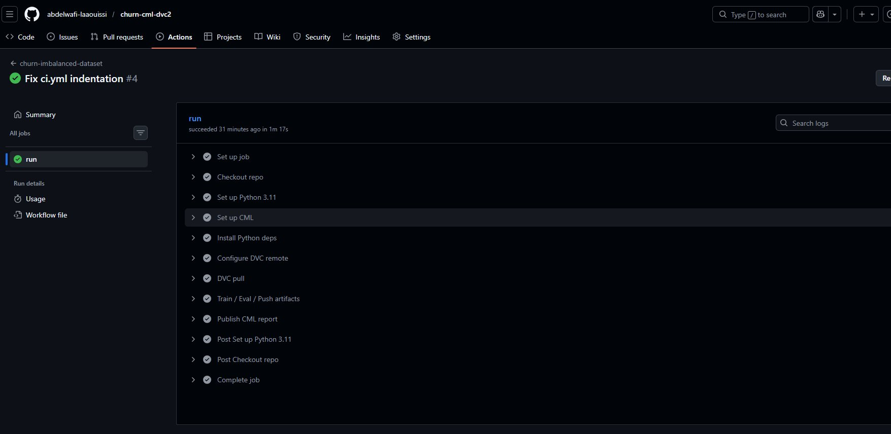
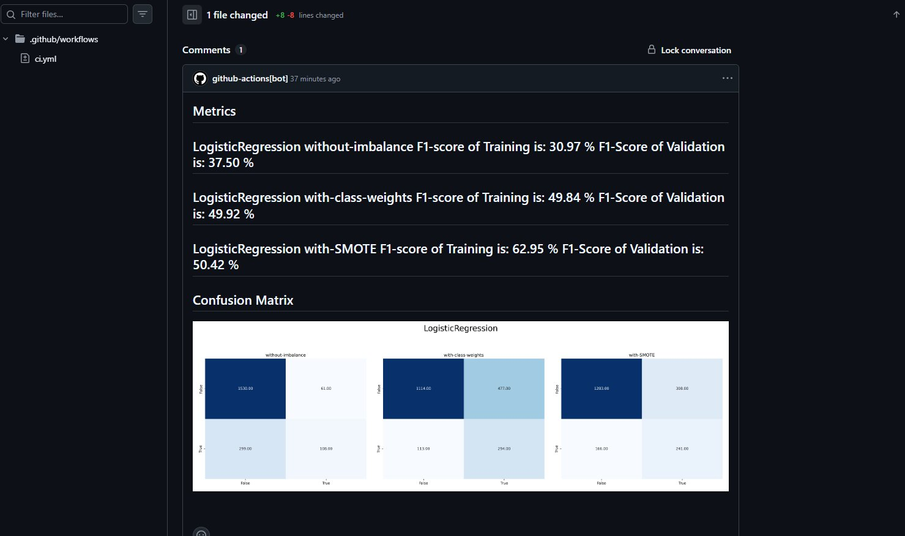
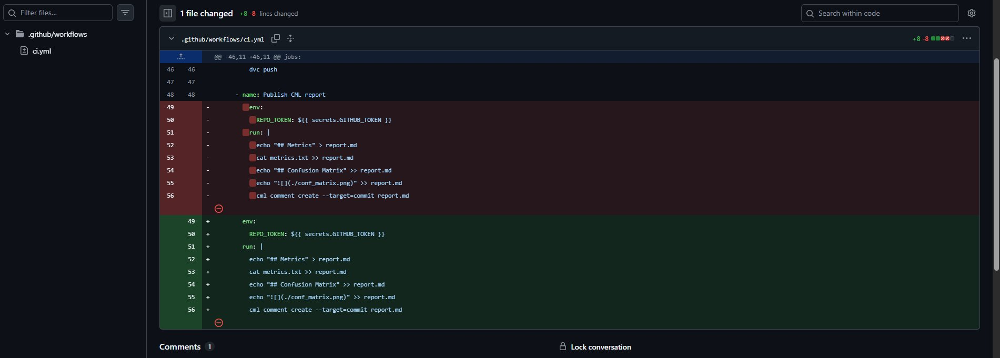

# 🚀 Atelier 4 – MLOps de bout en bout
### DVC + DagsHub + GitHub Actions + CML
**Projet : churn-cml-dvc** | *Pr. Soufiane HAMIDA — ENSET Mohammedia*

---

## 🎯 Objectif

Pipeline MLOps complet pour la prédiction du churn client :
- **Versioning des données et modèles** avec DVC + DagsHub
- **Pipeline CI/CD automatisé** avec GitHub Actions
- **Rapport automatique** (métriques + matrice de confusion) avec CML

---

## 🏗️ Architecture du projet

```
churn-cml-dvc/
├── .github/
│   └── workflows/
│       └── ci.yml              ← Pipeline CI/CD GitHub Actions
├── data/
│   └── dataset.csv             ← Dataset (tracké par DVC)
├── models/
│   ├── LogisticRegression-without-imbalance.pkl
│   ├── LogisticRegression-with-class-weights.pkl
│   └── LogisticRegression-with-SMOTE.pkl
├── script.py                   ← Entraînement + génération métriques
├── metrics.txt                 ← Métriques générées automatiquement
├── conf_matrix.png             ← Matrice de confusion générée
├── data.dvc                    ← Métadonnées DVC
├── models.dvc                  ← Métadonnées DVC
└── requirements.txt
```

---

## 🔧 Stack technique

| Outil | Rôle | Version |
|-------|------|---------|
| Python | Langage | 3.11 |
| scikit-learn | ML | ≥1.7, <1.8 |
| imbalanced-learn | SMOTE | ≥0.14, <0.15 |
| DVC | Versioning data/modèles | 3.63.0 |
| DagsHub | Remote storage | - |
| GitHub Actions | CI/CD | - |
| CML | Rapport automatique | v2 |

---

## 📋 Étapes réalisées

### 1 — Initialisation Git & DVC

```bash
git init && git add . && git commit -m "Initial commit"
dvc init
git add .dvc .gitignore
git commit -m "Init DVC"
```

### 2 — Configuration Remote DagsHub

```bash
dvc remote add -d myremote https://dagshub.com/laaouissi.f/churn-cml-dvc.dvc
dvc remote modify myremote --local auth basic
dvc remote modify myremote --local user laaouissi.f
dvc remote modify myremote --local password <TOKEN>
git add .dvc/config && git commit -m "Add DVC remote DagsHub"
```

### 3 — Versioning données & modèles

```bash
python script.py
dvc add data models
git add data.dvc models.dvc
git commit -m "Track data/ and models/ with DVC"
dvc push   # 9 fichiers poussés vers DagsHub ✅
```

### 4 — Secrets GitHub

| Secret | Valeur |
|--------|--------|
| `DAGSHUB_USERNAME` | `laaouissi.f` |
| `DAGSHUB_TOKEN` | Token DagsHub |

### 5 — Pipeline GitHub Actions (ci.yml)

```yaml
name: churn-imbalanced-dataset
on: [push]
permissions: write-all
jobs:
  run:
    runs-on: ubuntu-latest
    steps:
      - Checkout repo
      - Set up Python 3.11
      - Set up CML
      - Install Python deps
      - Configure DVC remote
      - DVC pull
      - Train / Eval / Push artifacts
      - Publish CML report
```

---

## 🖼️ Captures d'écran

### DagsHub — Remote DVC configuré


### Liste des commits GitHub


### Historique des workflows GitHub Actions


### Pipeline GitHub Actions — toutes les étapes ✅


### Rapport CML publié automatiquement sur le commit


### Détail du commit — diff ci.yml


---

## 📊 Résultats — Métriques automatiques

| Modèle | F1 Train | F1 Validation |
|--------|----------|---------------|
| LogisticRegression without-imbalance | 30.97% | 37.50% |
| LogisticRegression with-class-weights | 49.84% | 49.92% |
| **LogisticRegression with-SMOTE** | **62.95%** | **50.42%** ✅ |

> Le modèle avec **SMOTE** donne le meilleur F1-score en validation (50.42%)

---

## 🔄 Flux MLOps complet

```
[git push]
     ↓
[GitHub Actions déclenché automatiquement]
     ↓
dvc pull ← DagsHub (récupère data + models)
     ↓
python script.py (ré-entraîne le modèle)
     ↓
dvc push → DagsHub (sauvegarde nouvelle version)
     ↓
CML publie rapport automatiquement sur le commit
(métriques + matrice de confusion)
```

---

## 📦 Installation locale

```bash
git clone https://github.com/abdelwafi-laaouissi/churn-cml-dvc2.git
cd churn-cml-dvc2
pip install -r requirements.txt
pip install "dvc[http]==3.63.0"
dvc pull
python script.py
```

---

## 👨‍🎓 Auteur

**Abdelwafi Laaouissi** — M2 MLOps  
Université Hassan II de Casablanca — ENSET Mohammedia  
*Atelier 4 — Pr. Soufiane HAMIDA — Janvier 2026*
